% CartoDB Exercises
% [MaptimeATX](http://maptimeatx.github.io)
% August 12, 2015

-------------------------------------------------

# CartoDB Exercises

Presentation viewable at [maptimeatx.github.io/cartodb-exercises/](http://maptimeatx.github.io/cartodb-exercises/)

Source code for the presentation is at [github.com/MaptimeATX/cartodb-exercises](https://github.com/MaptimeATX/cartodb-exercises)

# CartoDB

First, check out [maptime.io/cartodb-tutorial/](http://maptime.io/cartodb-tutorial/)

Then, get a CartoDB account at [cartodb.com/signup](https://cartodb.com/signup) for today's exercises

# Tutorial - World Cities Map

[Natural Earth Data - naturalearthdata.com](http://www.naturalearthdata.com/)

This is a great resource for general cartographic data, and it's public domain!

# Tutorial - World Cities Map

. . .

Download [Natural Earth Data Populated Places Simple](http://www.naturalearthdata.com/downloads/50m-cultural-vectors/50m-populated-places/) Shapefile: [goo.gl/QtJiCn](http://goo.gl/QtJiCn)

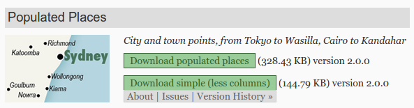

Open [cartodb.com](http://cartodb.com) and log in

Drag the downloaded `ne_50m_populated_places_simple.zip` file into your CartoDB Dashboard

# Tutorial - World Cities Map

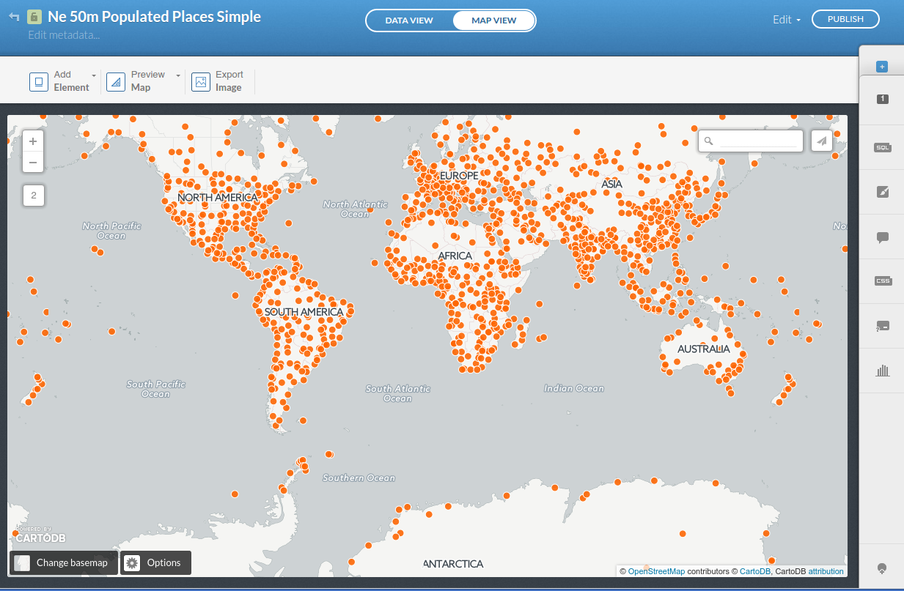

# Tutorial - World Cities Map

. . .

Explore the **Data View**, note the different columns (especially `pop_max`)

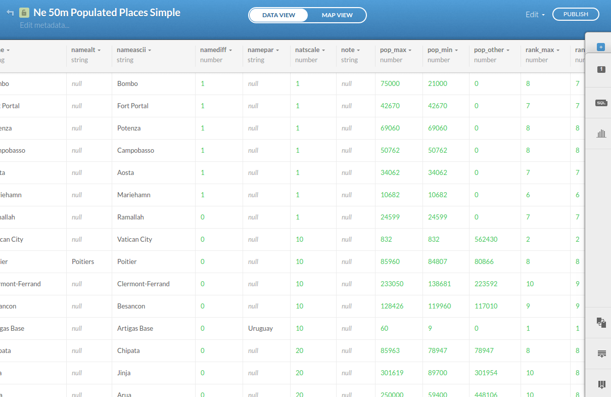

# Tutorial - World Cities Map

. . .

Explore the **Map View**, experiment with the Wizards.

Try making a **Bubble Map** based on population.

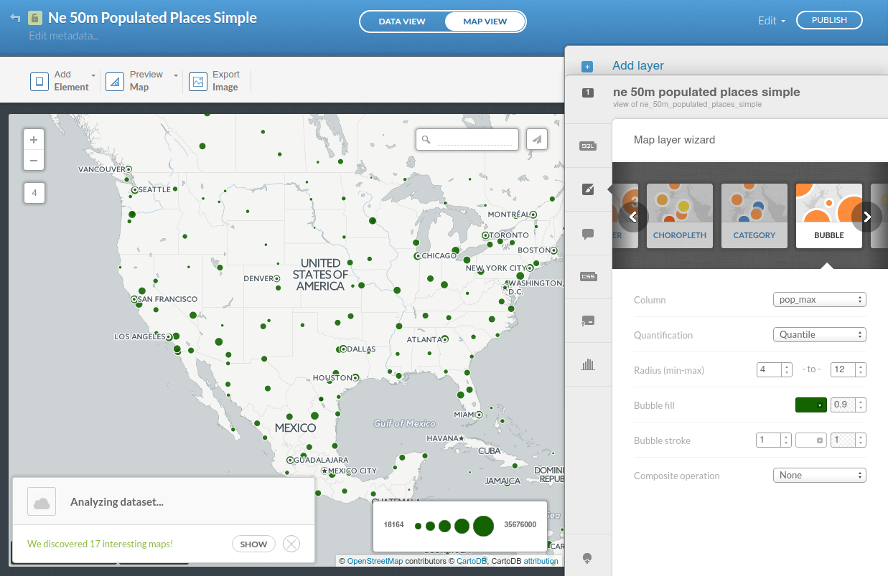

# Tutorial - World Cities Map

. . .

Add an **Info Window** to display `name` and `pop_max`

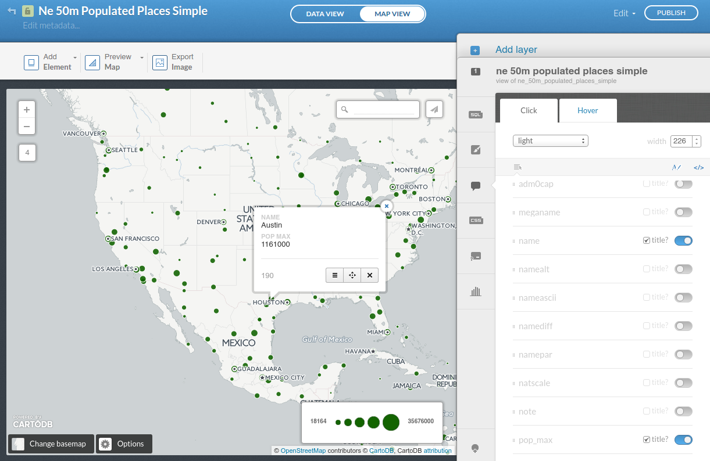

# Tutorial - World Cities Map

. . .

Check out the **CartoCSS Editor** tab. That's the `code` for all the styling rules.

Instead of using the Wizard, we could have done all the styling manually in this tab.

# Tutorial - World Cities Map

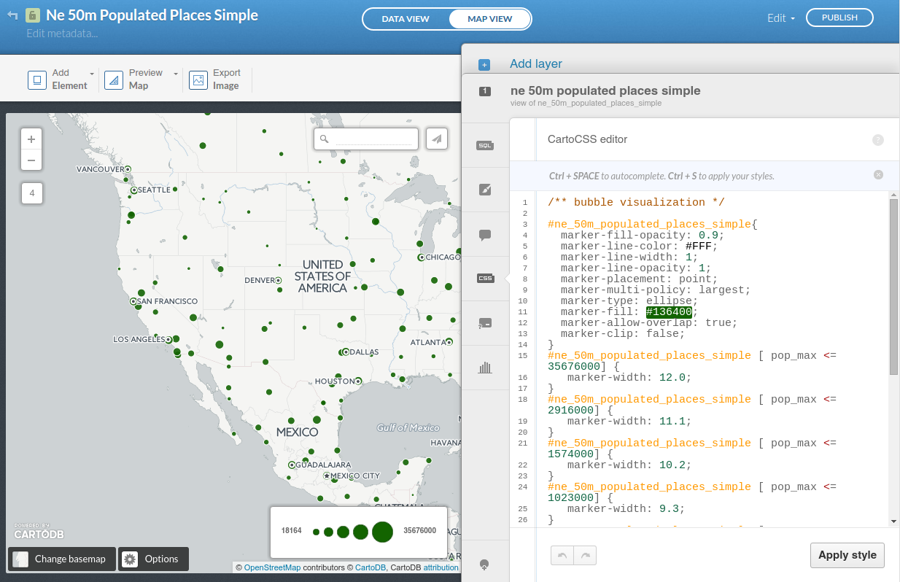

# Tutorial - World Cities Map

Add the following rule to add labels to your city dots:

```
#ne_50m_populated_places_simple::labels {
  text-name: [name];
  text-face-name: 'DejaVu Sans Book';
  text-size: 10;
  text-label-position-tolerance: 10;
  text-fill: #000;
  text-halo-fill: #FFF;
  text-halo-radius: 1;
  text-dy: -8;
  text-allow-overlap: true;
  text-placement: point;
  text-placement-type: simple;
}
```

(Visit [goo.gl/zGqpGA](https://goo.gl/zGqpGA) to copy-paste)

# Tutorial - World Cities Map

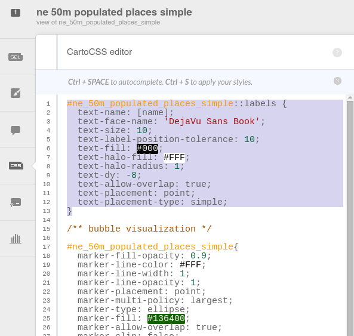

# Tutorial - World Cities Map

. . .

Now that we have labels, let's change the basemap to one without its own labels

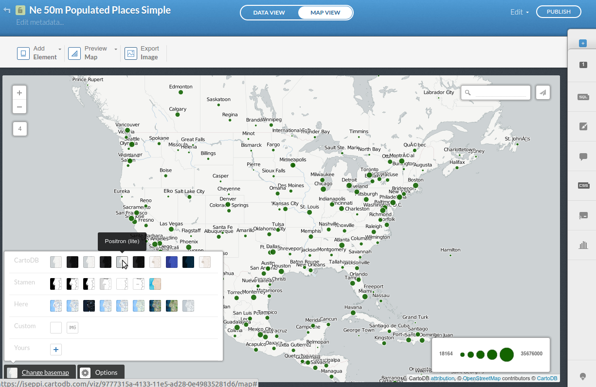

# Tutorial - World Cities Map

. . .

Click Visualize, then Publish to get a shareable link to your map

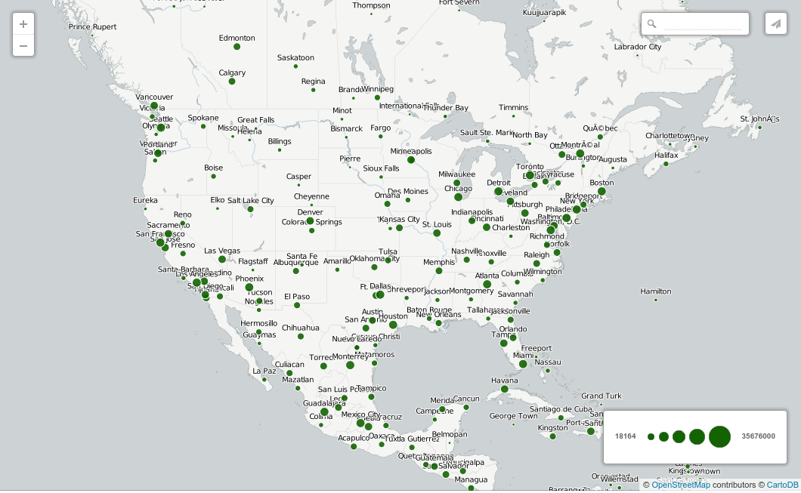

# Exercise 1 - Population Choropleth

. . .

Introduce yourself to the person next to you and *work together* for this exercise


# Exercise 1 - Population Choropleth

**Choropleth Map** - a map where areas are shaded or patterned in proportion to a statistical variable being displayed on the map ([en.wikipedia.org/wiki/Choropleth_map](http://en.wikipedia.org/wiki/Choropleth_map))

# Exercise 1 - Population Choropleth

1. Download [Map Academy's Counties Shapefile](http://acdmy.org/d/counties.zip): [acdmy.org/d/counties.zip](http://acdmy.org/d/counties.zip)

1. Import the downloaded `counties.zip` file into your CartoDB Dashboard

1. Use the Wizard to make a Choropleth Map based on population. *Hint: Use `pop_sqkm`*

-------------------------

<div class="big-image">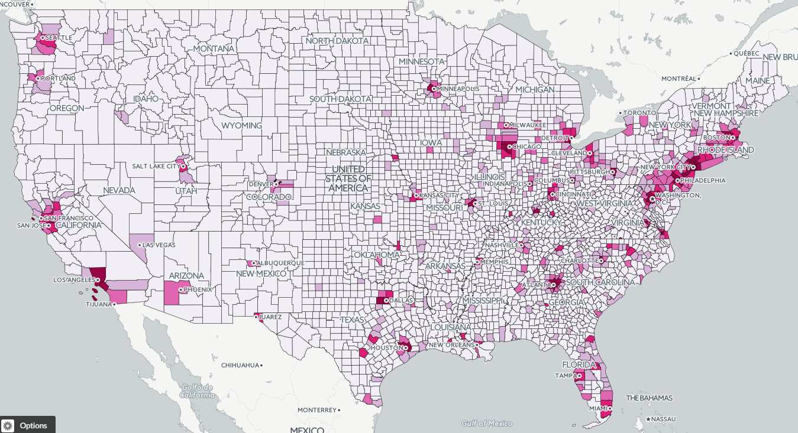</div>

# Exercise 2 - Explore Earthquakes Data

. . .

1. Download [All Earthquakes for the Last 30 Days](http://earthquake.usgs.gov/earthquakes/feed/v1.0/csv.php) from USGS: [goo.gl/hhoAyK](http://goo.gl/hhoAyK)

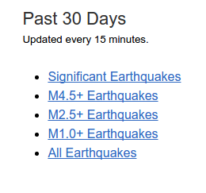

2. Import the `all_month.csv` into your CartoDB account (drag and drop)

3. Experiment with the Wizard tab. Try Heat Map, Intensity, Density, maybe even Torque.

Example: [cdb.io/1JUy0WP](http://cdb.io/1JUy0WP)

# Good Job!

. . .

Thanks to all of you for coming!


Thanks to [ObjectRocket](https://objectrocket.com/) for hosting and [CartoDB](http://cartodb.com) for the pizza!

Learn more about CartoDB at the [CartoDB Map Academy](http://academy.cartodb.com/)
